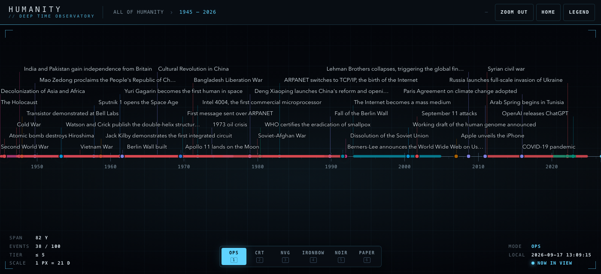
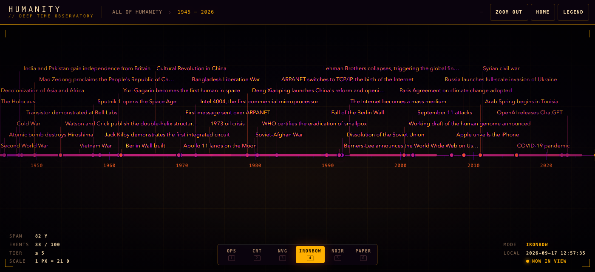
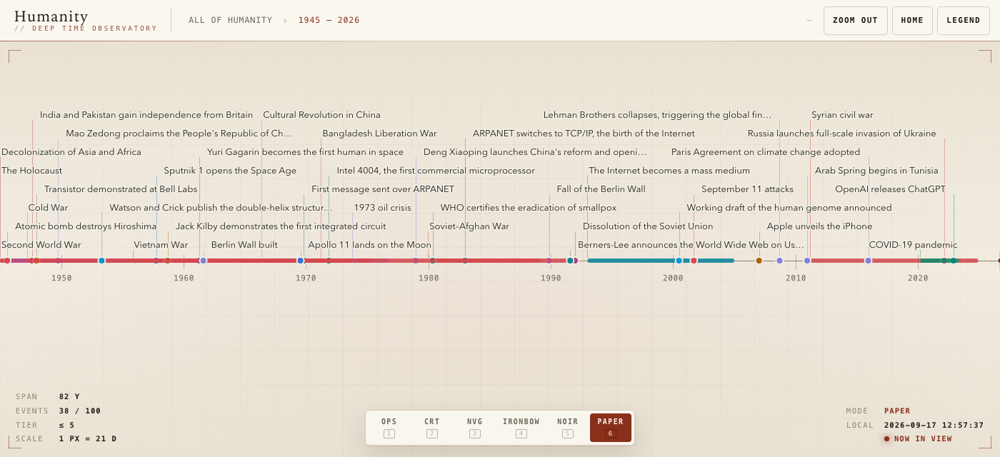

# Humanity — a zoomable timeline

**Live:** https://dshills.github.io/Humanity/


<p>
  
  
  
</p>

A single self-contained `index.html` that draws a horizontal timeline of human history from the first Homo sapiens (300,000 years ago) to today, rendered with vanilla JavaScript and SVG. Click anywhere on the axis to zoom in by 4×; each level reveals finer ticks and more events, down to single days. 3,982 events in 16 color-coded categories, each with a link for further reading, plus 800,000 years of climate data, are bundled into the page. There are no frameworks, nothing to install, and no network requests unless you switch on the optional Wikimedia content (images, article summaries and day-by-day events).

## Open it

- Double-click `index.html` (it works from `file://`), or serve the folder with any static server (`python3 -m http.server`, `npx serve`, …) and open it in Chrome, Safari or Firefox.
- No build is needed to view it: `index.html` is the finished artifact.
- To change anything, edit the files under `src/` and rebuild:

```
node build.mjs        # inlines src/ into index.html (fails loudly on problems)
node --test test/     # runs the 270 tests
```

Node 18 or newer, zero dependencies. The build concatenates `time.js, tiers.js, ticks.js, layout.js, data/*.js (sorted by filename), app.js` into one `<script>`, inlines `styles.css`, appends `HT.app.init();`, and refuses to write output if any source is missing, the bundle has a syntax error, a source uses `import`/`export`/`require(`, or the page would reference an external URL.

## Using the timeline

| Action | Result |
|---|---|
| Click empty axis | Zoom in 4× centered on the clicked date (animated, 250 ms) |
| Shift+click, **Zoom out** button, `-` key | Zoom out: undoes the last click/button zoom, otherwise 4× around the view center |
| **Home** button, `0` key | Back to the root view (300,000 years ago – today) |
| `+` / `=` key | Zoom in 4× at the view center |
| Mouse wheel / trackpad pinch | Zoom around the cursor; Shift+wheel or horizontal scroll pans |
| Touch pinch | Zoom, keeping the date under each finger fixed |
| Drag | Pan (nothing to pan at the root view) |
| **Recorded history** bracket | On views wider than 20,000 years, everything since the first writing (c. 3300 BCE) is a sliver at the right edge; a labelled bracket marks it, and clicking it (or Enter while it has focus) zooms to 3500 BCE – today |
| **Today** line | A view can run 3.5% past the present, so today is a marked line with a little empty room after it rather than the clipped right edge; nothing is ticked or plotted beyond it |
| Breadcrumbs | The chain of views from `All of humanity` to the current one; click any crumb to return to it |
| Browser back / forward | Steps through zoom history; the URL hash (`#s=<start>&e=<end>`, plus `&ev=<event>` while a panel is open) is shareable and reloads to the same view |
| Overview strip under the header | All 300,000 years on a logarithmic scale with the current view marked; click to jump there, drag the marker to scrub |
| Hover | A vertical guide line and the date under the cursor in the header; hovering an event shows a tooltip with its date and detail |
| Click an event | Opens the side panel (bottom sheet on narrow screens) with **Zoom to this event** and **Copy link to this event** buttons; clicking an event never triggers the axis zoom |
| **Legend** button | Toggles the legend: category filters and the region filter |
| **?** button, `?` key | Opens the guide, which also appears once on a first visit that did not arrive through a shared link |
| `Escape` | Closes the guide, else search, else the panel, else the legend, else the tooltip |

## Visual modes

The console has six sensor-style modes, switched from the dock at the bottom of the stage, with the number keys `1`–`6`, or by cycling with `T`:

| Key | Mode | Look |
|---|---|---|
| 1 | Ops | Near-black console, cyan accent, hairline grid (default in dark colour schemes) |
| 2 | CRT | Amber phosphor with rolling scanlines |
| 3 | NVG | Green night-vision: the whole stage passes through a gradient-map filter |
| 4 | Ironbow | Thermal palette, black → purple → red → yellow → white |
| 5 | Noir | High-contrast grayscale |
| 6 | Paper | Warm paper and ink with a serif display face (default in light colour schemes) |

The choice is remembered in `localStorage` and written into the URL as `m=<mode>`, so a shared link carries its look. With no choice made, the mode follows `prefers-color-scheme`. The HUD in the stage's corners shows the span in view, visible events out of those in the window, the tier ceiling, the scale in years per pixel, the mode, a local clock, and a beacon when the present moment is on screen.

## Earth layer

Three climate sparklines run beneath the axis and resolve as you zoom: atmospheric CO₂ (ice-core composite to 1957, Mauna Loa annual means since), Antarctic temperature anomaly (EPICA Dome C) and global sea level (Spratt & Lisiecki stack), covering the last 800,000 years. The HUD's **Earth** row shows the three values under the pointer. Toggle the layer with the **Earth** button or the `E` key; the choice is remembered.

Two human context series ride in the same layer, from `scripts/import-context.mjs` (`src/context.js`): **world population** as a dashed, log-scaled line from 10,000 BCE, and a **largest city** ribbon beneath the band naming the world's biggest city through time (Ebla, Ur, Babylon, Rome, Chang'an, Baghdad, Kaifeng, Hangzhou, Beijing, London, New York, Tokyo). The ribbon is hidden on views wider than 40,000 years, where five millennia of cities would be a barcode at the right edge. The HUD's City row names the city under the pointer. The ribbon is derived by interpolating each city between its own observations in Chandler's table and taking the largest at benchmark years; observations at least five times both neighbours are treated as digitisation slips and dropped (Delhi's 1375 figure carries an extra zero). On short screens the axis lifts slightly to make room, and the ribbon yields before the sparklines do.

The same import adds 263 natural-hazard events in a sixteenth category, `earth`: earthquakes with at least 10,000 recorded deaths or magnitude 8.5+, tsunamis with at least 5,000 deaths not already carried by their quake, and eruptions of VEI 6+ or at least 1,000 deaths, each linking to its NCEI record. Records within a year of a hand-curated quake, tsunami or eruption are skipped.

Regenerate both from the sources with:

```
node scripts/import-noaa.mjs   # writes src/earth.js and src/data/09-hazards.js, then rebuild
```

Population: Our World in Data, "Population, including UN projections" (CC BY 4.0); its values before 1800 derive from HYDE 3.3, which is CC BY-NC-SA 4.0, so reuse this series commercially only from 1800 onward. Cities: Chandler's historical urban population table as digitised by Reba, Reitsma & Seto (2016), figshare doi:10.6084/m9.figshare.2059494 (CC BY 4.0); the estimates are contested and end in 1975, where Tokyo has just passed New York. The ribbon's final Tokyo segment is carried to the present on the UN World Urbanization Prospects 2018 figure (37.4 million), since Tokyo has led every revision since.

Data credits (US Government works, unrestricted): Bereiter et al. 2015 CO₂ composite and Jouzel et al. 2007 EPICA Dome C temperature (NOAA NCEI Paleoclimatology); Spratt & Lisiecki 2016 sea-level stack (NOAA NCEI); NOAA GML Mauna Loa CO₂ record; NCEI/WDS Global Significant Earthquake, Tsunami and Volcanic Eruption Databases, doi:10.7289/V5TD9V7K.

## Wikidata layer

`scripts/import-wikidata.mjs` pulls two kinds of events from Wikidata (CC0, no attribution required) into `src/data/10-wikidata.js`:

- **Battles**: every item classed as a battle with a dated point in time and at least 20 sitelinks (roughly 600), tiered by sitelink count. A battle that a hand-curated event of the same year already names is skipped so the curated entry keeps its place.
- **Rulers and heads of government**: holders of more than 30 offices in 31 swimlanes, from pharaohs, Assyrian and Babylonian kings, Roman and Byzantine emperors, emperors of China, Japan and Ethiopia, popes, caliphs, khagans, sultans, Incas and tlatoque to US presidents, British and Indian prime ministers, French and Russian presidents, German chancellors and the general secretaries of the Chinese Communist Party. Each reign or term is a ranged event with at least 25 sitelinks. An office that was renamed or refounded keeps one lane: the Reich and Federal chancellors share "chancellor of Germany", and the crowns of England, Great Britain and the United Kingdom share "English and British monarch". The sitting holder of each living office (the latest start, with no end date and no date of death in Wikidata) is marked `ongoing`, so their bar runs to the Today line and their date reads "2017 – present"; the list is as of the last import, so re-run `node scripts/import-wikidata.mjs` after an election or a succession. Holders are named from their English label, falling back to the article title, because the query service's label lookup occasionally returns a bare item id.

With **Reigns** on (the header button or `R`, on by default on screens at least 640 px wide), rulers leave the ordinary event lanes and appear as **swimlanes** at the top of the stage: one row per office, each reign or term a bar labelled with the ruler's name when it fits. Rows keep a stable order, only offices with a holder in view are drawn, and when more offices are in view than there is room for, the most prominent ones stay. The event lanes always keep at least four rows. Bars behave like any other event: hover for the tooltip, click or press Enter for the panel. Category filters apply to the swimlanes too. On views wider than 20,000 years the swimlanes step aside, since every reign would be a sliver at the right edge.

Titles and one-line descriptions are Wikidata's own; each event links to its English Wikipedia article when one exists, otherwise to the Wikidata item. Dates are as recorded in Wikidata, which keeps pre-1582 dates in the Julian calendar. Regenerate with:

```
node scripts/import-wikidata.mjs   # writes src/data/10-wikidata.js, then rebuild
```

## Nobel Prizes and launches

- `scripts/import-nobel.mjs` writes `src/data/11-nobel.js`: one event per Nobel Prize since 1901 from the Nobel Foundation's API (CC0), dated by the announcement and linking to the prize's summary page. Physics, chemistry and economics are filed under science, medicine under medicine, literature under art and peace under politics.
- `scripts/import-gcat.mjs` writes `src/data/12-launches.js` from Jonathan McDowell's General Catalog of Artificial Space Objects (GCAT, CC BY 4.0, planet4589.org): every human orbital spaceflight launch, the first orbital launch from each launch site, and the first flight of each launch vehicle family with at least ten orbital launches. Launches within two days of a curated space event are skipped.

Both are build-time imports; the page still makes no network requests. Nobel Prize® is a registered trademark of the Nobel Foundation. Launch data: J. McDowell, planet4589.org.

## Map, filters and search

- **Where it happened.** The detail panel shows a small world map with a pin and crosshair for any event with known coordinates. Hazards, battles and launches carry coordinates from their sources; the hand-curated events get theirs from Wikidata through each event's Wikipedia link (`scripts/import-geo.mjs` writes `src/geo.js`). When the point comes from a related place, such as a location or birthplace, rather than the item itself, the caption says "approximate". Country-level places are never used: an event known only to a country, state, empire or continent shows no map rather than a pin at a centroid. The land outline is Natural Earth 110m (public domain), simplified to a single 17 KB path by `scripts/build-map.mjs`.
- **Category filters.** The legend's entries are toggles: click to hide or show a category, Shift+click to show only that one, and use All or None to reset. A dot on the Legend button marks an active filter, and the choice is remembered. Hidden categories are excluded before tier selection, so the remaining events fill the view.
- **Region filter.** Below the categories, the legend has a row of regions and a small world map; pick Africa, Europe, Asia, N. America, S. America or Oceania (or click the map) and only events located there remain. Regions are coarse latitude/longitude boxes, with the Middle East counted as Asia; rulers, who carry no coordinates, are placed by their office. Events with no known location are hidden while a region is chosen, and the choice is remembered alongside the category filter.
- **Search.** Press `/` or the Search button, type at least two characters, and pick a result with the arrow keys and Enter or a click. Title-prefix matches rank first, then word starts, then substrings, with ties going to the more significant event. Choosing a result zooms to the event and opens its panel, un-hiding its category and lifting the region filter if they would hide it.

## More in the panel

Every panel now ends with ways onward, none of which touch the network until followed:

- **Around this time**: the two nearest events before and after of comparable significance (no more than one tier finer than the open event, never finer than tier 4 unless it is), each with its distance in time; for a ruler, the predecessor and successor in the same office instead.
- **More in <category>**: the three nearest events of the same category, preferring the same region of the world.
- **Links**: the year's article on Wikipedia (back to 800 BCE), the calendar day's article for day-precise dates, the place on OpenStreetMap when the event is located, and the event's Wikidata item.

Choosing a listed event opens it, zooming only if it is not already on screen.

## Permalinks, overview strip and guide

- **Event permalinks.** Opening an event adds `ev=<slug>` to the hash, where the slug is the event's title in lowercase ASCII with dashes (`#s=1960&e=1975&ev=apollo-11-lands-on-the-moon`). Loading or navigating to such a link opens the panel, and lifts any saved filter that would hide the event. Titles are unique across the data, so a slug stays valid for as long as its title does; an unknown slug is ignored. **Copy link to this event** puts the current URL on the clipboard.
- **Overview strip.** The strip under the header plots every event's density against years before the present on a log scale, so the last few thousand years get as much room as the first quarter-million. The marked window behaves like a scrollbar thumb: it keeps its width on the strip as you drag, which means the span in view grows as you move back in time. A click from the root view picks a window an eighth of the strip wide.
- **Guide.** A one-screen summary of the gestures and keys, shown once on a first visit without a hash and on demand from the **?** button or key (`ht-help-seen` in `localStorage`).

## Conflicts and museum objects

- `scripts/import-ucdp.mjs` writes `src/data/13-conflicts.js` from the UCDP/PRIO Armed Conflict Dataset v26.1 (CC BY 4.0): the 116 conflicts since 1946 that reached war intensity (1,000 or more battle-related deaths in a year) and are not already covered by a curated war, each merged from its conflict-year rows into one ranged event linking to its UCDP page. Colonial wars are named for the territory and the power it fought. Cite Davies, Pettersson & Öberg (2026) and Gleditsch et al. (2002).
- `scripts/import-objects.mjs` writes `src/objects.js`: 33 events paired with a museum object, such as David's *Death of Socrates*, Rembrandt's *Aristotle with a Bust of Homer*, Michelangelo's studies for the Libyan Sibyl, a proto-cuneiform tablet, the seated statue of Hatshepsut and Leutze's *Washington Crossing the Delaware*. Objects come from The Metropolitan Museum of Art and the Cleveland Museum of Art Open Access programmes (CC0). A pairing is accepted only when the object is public domain, has an image, and matches an expected title, maker, culture or period. The panel always shows the object as a text link; its image loads only with the opt-in below.

## Opt-in online content

The page makes no network requests on its own. The detail panel has one checkbox, **Load images, summaries and day-by-day events from Wikimedia and museums**, which is off by default. While it is on, opening an event that links to Wikipedia requests that article's summary from the Wikipedia summary API and the thumbnail's author and licence from Wikimedia Commons, shows the image with a credit line linking to the file page and the article's opening paragraph as a quotation (CC BY-SA 4.0, linked to its source), and caches the result locally (up to 200 events) so each article is asked for once. An event with a museum object also loads that object's image from the museum's server. Images hosted on English Wikipedia itself are fair-use files, not freely licensed, and are never shown. Requests carry no cookies or referrer, a slow response can never land on a different event, and if the network is unavailable the panel simply has no image. Untick the box and the page goes back to making no requests.

**On this day.** The bundled data thins out below a year: a random 30-day window since 1950 starts a median of one event, and before 1900 most are empty. With the switch on, any view of about a month or less (35 days) asks Wikipedia's "on this day" feed for each calendar day in view, nearest the centre first, six at a time, and adds that day's entries as extra point events: hollow markers with muted labels, the full sentence as the detail, the most event-like linked article as the main link and the rest listed beneath it. They yield to bundled events when lanes run short, are skipped when a bundled event on the same day already links the same article, carry no location (so a region filter hides them), and disappear when you zoom back out or untick the box. Each response is about 100 KB compressed; only the year, the sentence and the article titles are kept, in memory and in a 40-day `localStorage` cache, so a month loads in ten to twenty seconds the first time and instantly after that. While the switch is off, a chip on such views offers to turn it on (and can be dismissed for good); while it is on, the chip shows progress and the count. A permalink to one of these events opens once its day has loaded. Text is from Wikipedia, CC BY-SA 4.0.

## Significance scores

`scripts/score-significance.mjs` scores every event that links to English Wikipedia by averaging the z-scores of log10(12-month pageviews) and log10(Wikidata sitelinks). Scores are mapped to tiers by keeping the curated tier counts and re-dealing the tiers in score order. The Wikidata importer uses the same thresholds, so imported battles and rulers sit on the same scale as the curated events (never above tier 3). [docs/TIER-AUDIT.md](docs/TIER-AUDIT.md) lists the curated events the data disagrees with most. The signal measures article popularity rather than historical weight (applied raw, it would put YouTube on the 5,000-year view and sink most of prehistory into decade-only tiers), so `scripts/apply-tier-audit.mjs` applies it as a nudge: sitelinks weighted 70/30 over pageviews, a penalty for events after 1800, one tier per run and only where the disagreement is two tiers or more, age limits in both directions, and tiers 0 to 2 left editorial. One pass moved 222 of the 834 curated events by one tier. The scorer takes about fifteen minutes and caches its results in `scripts/cache/`.

## Adding an event

Events live in `src/data/NN-<era>.js`, one file per era, each pushing plain objects onto `HT.events`:

```js
{ t: ymd(1969, 3, 2),           // start: astronomical fractional year (required)
  end: ymd(2003, 11, 26),       // optional; omit for point events; must be > t
  title: 'Concorde in service',  // 1–80 chars, no trailing period, unique across all files
  detail: 'One or two sentences of context.',   // 20–300 chars
  tier: 6,                       // 0..7: the coarsest view at which it appears (see table below)
  category: 'technology' }       // one of the 15 categories
```

Date helpers (destructured from `HT.time` at the top of every data file):

| Helper | Meaning | Example |
|---|---|---|
| `bce(y, month?, day?)` | Year BCE (historical numbering) | `bce(3000)` → `-2999`; `bce(44, 3, 15)` → Ides of March |
| `ce(y, month?, day?)` | Year CE | `ce(1492)` → `1492`; `ce(1066, 10, 14)` |
| `ymd(year, month?, day?)` | Astronomical year plus optional month/day | `ymd(1969, 7, 20)` → `1969.5479…` |
| `ya(n)` | `n` years before 1950 | `ya(300000)` → `-298050` (the root start) |

Which file to put it in:

| File | Era |
|---|---|
| `01-prehistory.js` | 300,000 years ago – 10,000 BCE (dates via `ya`) |
| `02-ancient.js` | 10,000 BCE – 500 BCE |
| `03-classical.js` | 500 BCE – 500 CE |
| `04-medieval.js` | 500 – 1500 |
| `05-early-modern.js` | 1500 – 1800 |
| `06-modern.js` | 1800 – September 1945 |
| `07-postwar.js` | September 1945 – 1990 |
| `08-contemporary.js` | 1990 – today |

File an event by its start date; a range that crosses an era boundary stays in the file where it begins.

Rules enforced by `test/data.test.js`:

- `t` is a finite number in `[ROOT_START, now()]`; `end`, if present, is a finite number `> t` and `≤ now()`.
- `tier` is an integer 0..7; `category` is one of `origins, migration, technology, agriculture, civilization, empire, religion, science, art, war, exploration, politics, medicine, computing, space`.
- `title` is 1–80 characters with no trailing period; `detail` is 20–300 characters.
- No keys other than `t, end, title, detail, tier, category` (`id` is derived from the array index; do not author it).
- Titles are unique across all files (case-insensitive); at least 300 events in total.
- Representative windows keep a minimum number of visible events (8 at the root and each era window, 6 per decade window, 4 per year window), so lowering a tier can fail a test if a window empties out.

Convention (not machine-checked): events after 1900 carry day precision (`ymd(y, m, d)`) wherever the exact date is well known; approximate historical dates say so in the title or detail.

Then run `node --test test/` and `node build.mjs`.

### Links

Any event may carry an optional `link` (an `https://` URL, normally the English Wikipedia article). When present, the detail panel shows a **Read more** link that opens in a new tab. Following a link is the only way the page ever reaches the network; it makes no requests on its own.

```js
{ t: ymd(1969, 7, 20), title: 'Apollo 11 lands on the Moon', detail: '…', tier: 0, category: 'space',
  link: 'https://en.wikipedia.org/wiki/Apollo_11' }
```

## Tier-to-span mapping

`tierForSpan(span)` in `src/tiers.js`. An event is drawn when `event.tier <= tierForSpan(end - start)`:

| Tier | Shown when the view span is | Intended meaning |
|---|---|---|
| 0 | ≥ 100,000 years | The ~15 most consequential events in human history (root view) |
| 1 | ≥ 20,000 years | Matters at the scale of all civilization |
| 2 | ≥ 5,000 years | Matters at a 5,000-year scale |
| 3 | ≥ 1,000 years | Matters at a 1,000-year scale |
| 4 | ≥ 200 years | Matters at a 200-year scale |
| 5 | ≥ 50 years | Matters at a 50-year scale |
| 6 | ≥ 10 years | Matters at a decade scale |
| 7 | < 10 years | Only shown below a decade |

Current distribution of the 834 events: tier 0: 16, 1: 36, 2: 38, 3: 151, 4: 184, 5: 224, 6: 147, 7: 38.

## Time model

Every instant is one floating-point number `t` in astronomical years: `1 CE = 1`, `1 BCE = 0`, `2 BCE = -1`, so `3000 BCE = -2999`. The fractional part is the fraction of that calendar year elapsed, in the proleptic Gregorian calendar, UTC (so `ymd(1969, 7, 20)` is day 201 of 365, 1969.5479…). "Years ago" are counted from 1950 (the radiocarbon BP convention): `ya(n) = 1950 - n`, and the root start `ya(300000) = -298050`. "Today" is `new Date()` converted to `t`. Views are `[start, end]` clamped to `[ROOT_START, today]`, with a minimum span of one day (`1/365.25`).

Label style depends on the span of the current view (`formatDate(t, span)`):

| Regime | View span | Style | Example |
|---|---|---|---|
| ago | > 20,000 years | years ago | `250,000 years ago` |
| year | 2 – 20,000 years | historical year | `3000 BCE`, `79 CE`, `1492` |
| month | 0.25 – 2 years | month + year | `Jul 1969` |
| day | ≤ 0.25 years | month, day, year | `Jul 20, 1969` |

## Project layout

```
index.html              built artifact: one self-contained page (output of node build.mjs)
build.mjs               bundler: inlines src/ into the template, validates the result
PROMPT.md               product spec
CONTRACT.md             module interfaces every src file is written against
README.md               this file
src/
  index.template.html   HTML skeleton with <!--STYLES--> and <!--SCRIPTS--> placeholders
  styles.css            all CSS: theme tokens, layout, panel, tooltip, legend
  time.js               HT.time: time model, calendar math, date/range formatting
  tiers.js              HT.tiers: categories, colors, tierForSpan, tierSpan
  ticks.js              HT.ticks: tick ladder, nice positions, minor ticks, label thinning
  layout.js             HT.layout: greedy lane packing for event labels
  app.js                HT.app: rendering, zoom/pan/pinch, history and URL state, panel
  data/
    01-prehistory.js    44 events, 300,000 years ago – 10,000 BCE
    02-ancient.js       56 events, 10,000 BCE – 500 BCE
    03-classical.js     60 events, 500 BCE – 500 CE
    04-medieval.js      59 events, 500 – 1500
    05-early-modern.js  66 events, 1500 – 1800
    06-modern.js        71 events, 1800 – 1945
    07-postwar.js       72 events, 1945 – 1990
    08-contemporary.js  62 events, 1990 – today
test/
  time.test.js          calendar conversions, histYear, every formatter
  tiers.test.js         tierForSpan, tierSpan, palette contrast on both backgrounds
  ticks.test.js         regimes, ladder selection, nice positions, minors, thinning
  layout.test.js        lane packing, priorities, gaps, drops, purity
  data.test.js          every rule listed under "Adding an event"
```

Tests use `node:test` and `node:assert` and load the browser scripts with `require`, reading `globalThis.HT`. They cover the pure modules; `app.js` is exercised in the browser.

## Decisions

Choices the spec left open, as implemented:

**Source layout and build**
- The page is authored as separate files under `src/` and bundled by `node build.mjs`. The deliverable is still one self-contained `index.html` with no runtime build step; the build exists only so the modules can be unit-tested with `node --test`.
- Every source file is a plain script wrapped in an IIFE that attaches to a shared `HT` namespace (`window.HT` in the browser, `globalThis.HT` in Node). No ES modules.
- Events are not a single `const EVENTS` literal; each era file pushes onto `HT.events`. In the built `index.html` the data files appear as consecutive blocks marked `/* ======== src/data/NN-era.js ======== */`, which is the block to extend by hand if you edit the built file directly.
- The build refuses to write output on any of: missing source, syntax error in the bundle, `import`/`export`/`require(` outside comments and strings, `</script` or `<!--` inside the bundle, `</style` inside the CSS, or a `src=`/`href=` pointing at an external URL.

**Time model**
- The root starts 300,000 years before 1950, not before today, so `ROOT_START = -298050`. "Years ago" everywhere means years before 1950, matching the BP convention used for radiocarbon dates.
- `formatAgo` returns `today` for anything at or after 1950 (and `1 year ago`, singular, for 1949); the root breadcrumb range therefore reads `300,000 years ago – today`.
- "Today" (the root end and the clamp on every view) is sampled once at page load, not on every render.
- The calendar is proleptic Gregorian in UTC, computed from day counts; the JS `Date` object is only read (`now()`, `fromDate`), never used for arithmetic. Astronomical year numbering keeps leap years regular (year 0 = 1 BCE is a leap year).
- No Julian-to-Gregorian conversion is applied to data: day-precision dates before 1582 (Hastings, the Ides of March, …) are the conventionally quoted calendar dates passed to `ymd` unchanged, so tooltips show the familiar date.
- Historical-year labels use `CE` only for years 1–999 (`79 CE`, but `1492`), thousands separators only from 10,000 (`10,000 BCE`, `3000 BCE`). In a range where either end is BCE, CE years get an explicit ` CE` (`10,000 BCE – 1 CE`).
- `formatRange` promotes precision when both ends sit exactly on a boundary: a view from Jul 1 to Aug 1 reads `Jul 1969 – Aug 1969`, not two full dates; a Jan 1 – Jan 1 view reads as years.
- `formatDateFull` (tooltips, panel, cursor readout) prefixes `c.` for anything earlier than 20,000 BCE, since those dates are round-figure estimates. Historical events whose date is approximate say so in the title or detail (`(c. 300 BCE)`).
- Event dates in the tooltip and panel: ranged events use `formatRange` (so `3100 BCE – 2900 BCE` rather than two "Jan 1" dates); point events before 1900 dated exactly Jan 1 show only the year, everything else shows the full date.
- The cursor readout in the header uses the full date when the view span is ≤ 20,000 years and "years ago" above that.

**Ticks**
- Target major spacing is 110 px: the smallest ladder interval whose average spacing is ≥ 110 px is used (the largest interval if none qualifies; thinning then keeps labels apart). Ladder: years `1, 2, 5 × 10^n` up to 5,000,000; months `1, 2, 3, 6`; days `1, 2, 7, 14`.
- The tick unit follows the label regime (years for "ago"/"year", months for "month", days for "day") so no two ticks ever share a label.
- Nice positions are in the space the reader sees. In the "ago" regime ticks sit at whole multiples of the step in years ago (`1950 - k·step`, so `300,000 / 250,000 / … years ago`). In the "year" regime with step ≥ 2 they sit at historical years that are multiples of the step, plus an epoch tick at 1 CE standing in for the nonexistent year 0 (`3000 BCE, 2000 BCE, 1000 BCE, 1 CE, 1000, 2000`). With step 1, every integer `t`. Months use the 1st of aligned months; days use days 1, 1+step, 1+2·step … restarting each month.
- In the "ago" regime the position at 1950 itself is never a labeled major (it would read `today` while the axis runs on to now); it is drawn as a minor.
- If the chosen interval is wider than the view and no major lands inside it (e.g. a 7-day step over a 6-day view), the next finer interval is used so the axis is never empty.
- Minor ticks are evenly spaced in `t` between consecutive majors and extended to both view edges: 5 subdivisions when the step's leading digit is 1 or 5, 4 when it is 2; months and days always 4. Minor ticks are never labeled.
- Overlapping labels are thinned, never shrunk: walk left to right, keep the first, suppress any label whose left edge would come within 12 px of the previous kept label's right edge. Widths are measured with a hidden SVG `<text>` (`getComputedTextLength`) and cached per string; the cache is cleared on resize. Labels near the edges are nudged inward and re-checked against the previous drawn label.

**Events and lanes**
- The axis sits at 62 % of the stage height; label lanes stack upward from it at a 26 px pitch, with 24 px kept clear at the top. The lane count is whatever fits, capped at 8 (the layout module's own default is 6; the app passes its cap explicitly).
- Packing is greedy by `(tier ascending, x ascending)` with an 8 px gap; each item takes the lowest lane where it overlaps nothing already placed, and when no lane is free the item (necessarily the highest tier among the contenders) is dropped from the view. The packer is a pure function with no DOM.
- Labels go to the right of the marker (or of the bar's visible left end) and flip to the left when they would overflow and the left side has room, or more room. Titles are truncated with an ellipsis to fit `max(60, min(320, 60 % of stage width))` px and the room actually available, so a label never leaves the stage.
- Point events are a 5 px-radius circle on the axis; ranged events a 6 px-tall bar from `t` to `end`; both connect to their label with a faint stem in the category color.
- "Zoom to this event": a ranged event is fitted with 15 % of its length padded on each side; a point event gets a span of `max(1 day, tierSpan(tier) / 10)` centered on it, where `tierSpan` is the lower bound of the tier's range (tier 0 → 10,000 years, tier 7 → 1 year).
- Taps are resolved on `pointerup` and a tap on an event opens the panel without zooming; native `click` is only used to stop propagation. A drag suppresses the click that follows it for 400 ms.

**Zoom, history and URL**
- Zoom-in computes the new span from the committed view, not the in-flight animation frame, so rapid clicks compound to 16×, 64×, …
- Zoom out reverses the last discrete zoom (click, `+`, Zoom to this event, or a breadcrumb) only while the current view is still exactly that entry; after any wheel, pinch or drag it zooms out 4× around the center and replaces the current crumb instead of popping one.
- Breadcrumbs are a stack from root to current in which every entry contains the next. A discrete zoom pushes a crumb; continuous zoom (wheel, pinch, drag) replaces the top crumb; any ancestor that no longer contains the view is popped. The root crumb reads `All of humanity`; the others are `formatRange(start, end)`.
- URL hash: `#s=<start>&e=<end>`, numbers rounded to 9 decimals with trailing zeros trimmed. Discrete zooms call `history.pushState`; continuous zoom calls `replaceState`, debounced 200 ms (Safari rate-limits history writes). The breadcrumb stack is stored in `history.state`, so back/forward and reload restore the crumbs; when it is missing the chain is derived as root → current. An invalid or absent hash means the root view; parsed views are clamped.
- Transitions animate over 250 ms with a cubic ease-out, interpolating `log(span)` and the center so that zooming looks uniform at every scale. A 350 ms safety timer lands the view if animation frames are starved. Animation is skipped under `prefers-reduced-motion`.
- Mouse wheel zooms by `exp(deltaY × 0.002)` per event, clamped to [0.5, 2]; a trackpad pinch (a wheel event with `ctrlKey`) uses `0.01` because it reports much smaller deltas. Shift+wheel and horizontal wheel deltas pan. Line- and page-mode deltas are scaled to pixels.
- Touch uses Pointer Events with `touch-action: none`; a press becomes a drag after 4 px of movement; a two-finger pinch keeps the date under each finger fixed by solving the linear pixel mapping; three or more fingers are ignored; when one finger of a pinch lifts, the other continues as a pan. Safari's `gesturestart`/`gesturechange` are suppressed. Touch pointers never show the tooltip or the cursor guide.
- Keyboard: `Escape`, `-`/`_` (zoom out), `0` (home), `+`/`=` (zoom in at center), `1`–`6` (visual mode), `T` (cycle modes), `E` (Earth layer), `R` (reign swimlanes), `/` (search). Ignored while Ctrl, Alt or Meta is held or while focus is in a form field. There is no Home-key binding; Home is the button.
- The stage is resized on `window.resize` and on a `ResizeObserver` for the stage (so opening the panel reflows without a window event), debounced 100 ms.

**Appearance**
- Dark theme by default with a light theme under `prefers-color-scheme: light`, via custom properties on `:root`; `color-scheme` and `theme-color` metas follow suit. Category markers keep their colors under `forced-colors`.
- The 15 category colors are hues spaced about 24° apart in OKLCH with alternating lightness, each with a WCAG contrast ratio ≥ 3:1 against both surfaces (`#0f1115` dark, `#f7f7f5` light); `test/tiers.test.js` checks this.
- The side panel is a 320 px right column that pushes the stage (no overlay) at ≥ 641 px, and a bottom sheet capped at 45 vh at ≤ 640 px. It takes focus when opened.
- Tooltips are positioned near the pointer and flipped or clamped to stay inside the stage.
- System font stack for UI, a serif display face for the title and panel heading, tabular figures on date readouts, 40 px minimum touch targets.

**Data**
- 834 events (spec minimum 300), every one with a verified English Wikipedia link, across eight era files, sparse in prehistory and dense after 1500; every event since September 1945 has a day-precision date.
- Prehistory dates are round figures via `ya(n)`. Ranged events (wars, reigns, movements) use `end`; a range that begins in one era but ends in a later one stays in the file where it starts.
- The `id` of an event is its index in `HT.events`, assigned by the app, never authored.

### Interaction robustness (added after browser testing)

- `zoomIn` / `zoomOut` derive the new span from the committed view, not from the frame currently on screen, so rapid clicks during the 250 ms animation each zoom a further ×4 instead of being collapsed into one.
- A press no longer cancels a running zoom animation; only the start of a drag or pinch does, and the pan then continues from the frame that was showing. Clicking an event mid-animation therefore never freezes the view at an intermediate frame.
- The animation has a `setTimeout` safety net (`ANIM_MS + 100`) that lands on the target view even when `requestAnimationFrame` is starved (background tab, busy main thread).
- The breadcrumb bar scrolls to its end on every render so the current crumb stays visible; below 641 px the header is a wrapping flex row so the date readout is sized by its own text rather than sharing a column with the buttons.
- Event labels are truncated to the room actually available on whichever side of the marker they are placed, so a label never extends past the stage edge.

### Review-driven fixes

- A zoom-in centred near a view's edge is shifted inward so the child view stays inside its parent; the breadcrumb chain is always a nesting chain and Zoom Out always reverses the last step.
- The root's end is written to the URL and history state as the token `now` (`#s=-298050&e=now`), and a parsed view whose edges fall on the root bounds (end within an hour of now) snaps to the root, so a shared or reloaded root link is recognised as the root.
- Clicking the axis at maximum zoom (one day) is a no-op instead of a pan that pushes history entries.
- Sparse windows admit lower tiers until at least 8 events are in view (the tier table gives the floor; lane packing still trims overflow), so a first click into deep prehistory never lands on an empty axis.
- Events are keyboard-accessible: every marker is a focusable `role="button"` with an accessible name; Enter or Space opens the panel and Escape returns focus to the marker. Invisible hit areas pad each marker and label so taps do not have to land on a 10 px dot.
- The header's date readout is refreshed after any zoom so it always describes the date under a resting pointer; the SVG viewBox is updated immediately on resize (the 100 ms debounce only covers tick and lane recomputation).
- The panel's category caption uses the muted text colour with a coloured dot instead of the category hue as text, for contrast.
- Minimum span is 1/365 of a year so a day-level view always contains a midnight tick; `computeTicks` additionally falls back to quarter-day positions for sub-day windows.
- Event dates authored as round "years ago" figures before 10,000 BCE are shown as `c. N years ago` in the tooltip and panel rather than a spuriously precise BCE year.

## License

MIT — see [LICENSE](LICENSE).

### Observatory UI (visual modes)

- The chrome speaks one voice: monospace, uppercase, wide-tracked micro-type for every instrument label (breadcrumbs, readouts, buttons, tick labels), while event labels stay in a sans face for lane density and the panel body reads in a serif.
- Six modes are CSS token sets on `html[data-theme]`; NVG, Ironbow and Noir additionally run the SVG stage through `feComponentTransfer` gradient-map filters defined inline, so the category colours are re-mapped by luminance the way a sensor would render them.
- Atmosphere layers (grain, scanlines, vignette) are always in the DOM and per-mode tokens set their opacity; CRT animates a slow refresh band. All are `pointer-events: none` and switched off under `forced-colors`.
- When a zoom settles (animation end, or any discrete view change), events animate into their lanes with a 22 ms stagger; continuous wheel, drag and pinch renders never animate. Tier 0 and 1 point markers carry a slow pulse ring.
- The mode is stored under `ht-theme` in `localStorage` and serialised as `m=` in the hash only when explicitly chosen; `auto` is never written so the system preference keeps working for people who never picked one.
